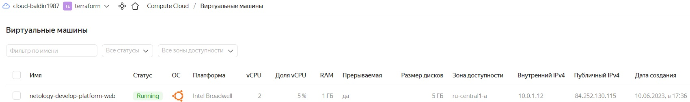
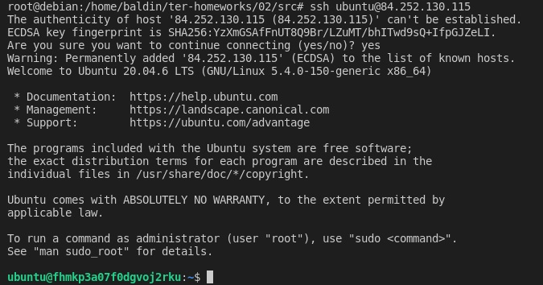
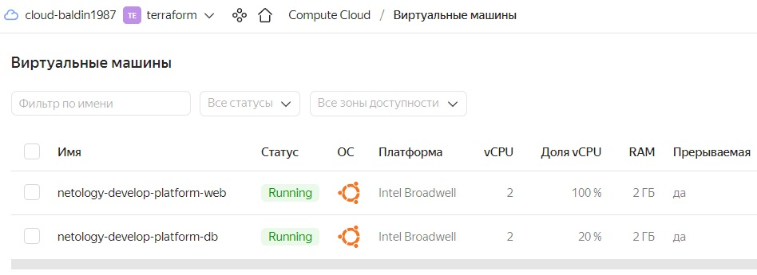
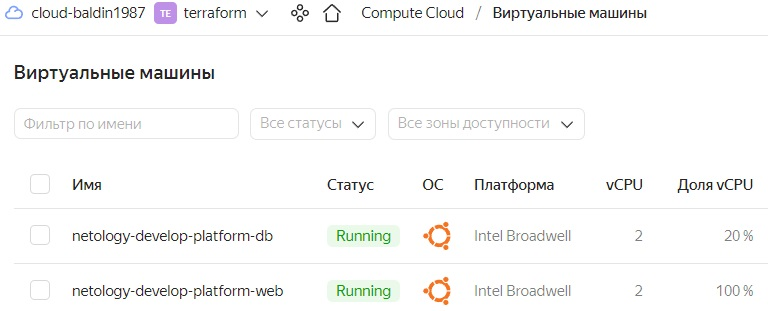

# Домашнее задание к занятию «Основы Terraform. Yandex Cloud» - Балдин 

### Задание 0

1. Ознакомьтесь с [документацией к security-groups в Yandex Cloud](https://cloud.yandex.ru/docs/vpc/concepts/security-groups?from=int-console-help-center-or-nav).
2. Запросите preview доступ к данному функционалу в ЛК Yandex Cloud. Обычно его выдают в течении 24-х часов.
https://console.cloud.yandex.ru/folders/<ваш cloud_id>/vpc/security-groups.   
Этот функционал понадобится к следующей лекции. 


### Задание 1

1. Изучите проект. В файле variables.tf объявлены переменные для yandex provider.
2. Переименуйте файл personal.auto.tfvars_example в personal.auto.tfvars. Заполните переменные (идентификаторы облака, токен доступа). Благодаря .gitignore этот файл не попадет в публичный репозиторий. **Вы можете выбрать иной способ безопасно передать секретные данные в terraform.**
3. Сгенерируйте или используйте свой текущий ssh ключ. Запишите его открытую часть в переменную **vms_ssh_root_key**.
4. Инициализируйте проект, выполните код. Исправьте намеренное допущенные ошибки. Ответьте в чем заключается их суть?
   > #### Допущена ошибка при указании платформы:
   > ```bash
   > │ Error: Error while requesting API to create instance: server-request-id = 45555bea-b7cc-4c43-836e-8ad745b1b25d server-trace-id = 
   > │ 569e7db861d88567:514e89817c006093:569e7db861d88567:1 client-request-id = 90bcd53b-e2bc-4286-a51a-cbc26f645852 client-trace-id = 22658f9b-89d2-403e-bcc3-a63e27606892 rpc
   > │ error: code = FailedPrecondition desc = Platform "standart-v4" not found
   >  
   > │   with yandex_compute_instance.platform,
   > │   on main.tf line 15, in resource "yandex_compute_instance" "platform":
   > │   15: resource "yandex_compute_instance" "platform" {
   >  ```
   > #### Исправил на `standard-v1`, после чего появилась ошибка:
   > ```bash
   > │   Error: Error while requesting API to create instance: server-request-id = 502043c9-2511-4f09-ba2a-e3ec5df9ab30 server-trace-id =  
   > │   7768d83997401d8b:9b9ac3b6750b44c4:7768d83997401d8b:1 client-request-id = d13ba5d1-761f-45e5-96f3-8462765d5564 client-trace-id = fcd91e14-450e-4a0c-8a46-207e0ca55f7b rpc 
   > │   error: code = InvalidArgument desc = the specified number of cores is not available on platform "standard-v1"; allowed core number: 2, 4
   > ```
   > #### Указал 2 ядра и `terraform apply` прошла без ошибок.

5. Ответьте, как в процессе обучения могут пригодиться параметры```preemptible = true``` и ```core_fraction=5``` в параметрах ВМ? Ответ в документации Yandex cloud.
   > #### Параметр `preemptible = true` устанавливается чтобы создать прерываемую ВМ. Она дешевле, хотя и имеет ряд ограничений: может быть остановлена в любой момент, может не запуститься (если в зоне доступности не хватает ресурсов), для неё не действует SLA. Но в процессе обучения на эти ограничения можно, в принципе, прищурить глаза.
   > #### `core_fraction=5` - уровень производительности 5%. Он гарантирует максимальное выделение ресурсов согласно выбранной платформы в течение данной части времени. То есть в этом конкретном случае 5% процессорного времени ВМ может работать на максимальной частоте, предоставляемой выбранной платформой intel broadwell. Этот параметр тоже очень полезен в период обучения, так как в этом случае нет никакой необходимости платить лишние деньги за гарантированный уровень производительности 100%.

В качестве решения приложите: 
- скриншот ЛК Yandex Cloud с созданной ВМ,

   >    

- скриншот успешного подключения к консоли ВМ через ssh,

   >    

- ответы на вопросы - *в тексте задания выше*
---

### Задание 2

1. Изучите файлы проекта.
2. Замените все "хардкод" **значения** для ресурсов **yandex_compute_image** и **yandex_compute_instance** на **отдельные** переменные. К названиям переменных ВМ добавьте в начало префикс **vm_web_** .  Пример: **vm_web_name**.
   > ```bash
   >  data "yandex_compute_image" "ubuntu" {
   >    family = var.vm_web_image_name
   >    }
   >    
   >    resource "yandex_compute_instance" "platform" {
   >      name        = var.vm_web_instance_name
   >      platform_id = "standard-v1"
   >      resources {
   >      cores         = var.vm_web_cores
   >      memory        = var.vm_web_memory
   >      core_fraction = var.vm_web_core_fraction  
   >      }
   >      ```
3. Объявите нужные переменные в файле variables.tf, обязательно указывайте тип переменной. Заполните их **default** прежними значениями из main.tf. 
   > ```bash
   > ### yandex_compute_image vars
   > 
   > variable "vm_web_image_name" {
   >   type        = string
   >   default     = "ubuntu-2004-lts"
   >   description = "release_name_of_image"
   > }
   > 
   > ### yandex_compute_instance vars
   > 
   > variable "vm_web_instance_name" {
   >   type        = string
   >   default     = "netology-develop-platform-web"
   >   description = "name_of_instance"
   > }
   > 
   > variable "vm_web_cores" {
   >   type        = number
   >   default     = 2
   >   description = "count_of_cores_vm"
   > }
   > 
   > variable "vm_web_memory" {
   >   type        = number
   >   default     = 2
   >   description = "count_of_memory_vm"
   > }
   > 
   > variable "vm_web_core_fraction" {
   >   type        = number
   >   default     = 100
   >   description = "core_fraction_of_vm"
   > }
   > ```

4. Проверьте terraform plan (изменений быть не должно). 
   > ```bash
   > oot@debian:/home/baldin/ter-homeworks/02/src# terraform plan
   > yandex_vpc_network.develop: Refreshing state... [id=enp5sviqjetfu9buhd22]
   > yandex_vpc_subnet.develop: Refreshing state... [id=e9brln1338q1s5hokufh]
   > yandex_compute_instance.platform: Refreshing state... [id=fhm23msti5eq166tcipo]
   > 
   > Note: Objects have changed outside of Terraform
   > ```
   ---
   
### Задание 3

1. Создайте в корне проекта файл 'vms_platform.tf' . Перенесите в него все переменные первой ВМ.
2. Скопируйте блок ресурса и создайте с его помощью вторую ВМ(в файле main.tf): **"netology-develop-platform-db"** ,  cores  = 2, memory = 2, core_fraction = 20. Объявите ее переменные с префиксом **vm_db_** в том же файле('vms_platform.tf').
3. Примените изменения.

   >    

---

### Задание 4

1. Объявите в файле outputs.tf output типа map, содержащий { instance_name = external_ip } для каждой из ВМ.
2. Примените изменения.

В качестве решения приложите вывод значений ip-адресов команды ```terraform output```

   > ```bash
   > root@debian:/home/baldin/ter-homeworks/02/src# terraform output
   > db_instance_public_ip = "158.160.39.211"
   > web_instance_public_ip = "158.160.104.47"
   > ```

### Задание 5

1. В файле locals.tf опишите в **одном** local-блоке имя каждой ВМ, используйте интерполяцию ${..} с несколькими переменными по примеру из лекции.
2. Замените переменные с именами ВМ из файла variables.tf на созданные вами local переменные.
3. Примените изменения.
   > *Если я правильно понял задание, то:*
   > 1. Заполнил **locals.tf**
   > ```bash
   > locals {
   >   org      = "netology"
   >   project  = "develop"
   >   instance = "platform"
   > }
   > ```
   > 2. Указал имён ВМ при помощи local переменных (причем указывал я их уже в `main.tf`, так как в `variables` их не получается указать)
   > ```bash
   > name = "${ local.org }-${ local.project }-${ local.instance }-web"
   >   ```
   >   ```bash
   > name = "${ local.org }-${ local.project }-${ local.instance }-db"
   > ```
   > 3. Пересоздал инфраструктуру. Имена инстансов на месте:
   >    

### Задание 6

1. Вместо использования 3-х переменных  ".._cores",".._memory",".._core_fraction" в блоке  resources {...}, объедените их в переменные типа **map** с именами "vm_web_resources" и "vm_db_resources".
2. Так же поступите с блоком **metadata {serial-port-enable, ssh-keys}**, эта переменная должна быть общая для всех ваших ВМ.
3. Найдите и удалите все более не используемые переменные проекта.
4. Проверьте terraform plan (изменений быть не должно).

------

## Дополнительные задания (со звездочкой*)

**Настоятельно рекомендуем выполнять все задания под звёздочкой.**   
Их выполнение поможет глубже разобраться в материале. Задания под звёздочкой дополнительные (необязательные к выполнению) и никак не повлияют на получение вами зачета по этому домашнему заданию. 

### Задание 7*

Изучите содержимое файла console.tf. Откройте terraform console, выполните следующие задания: 

1. Напишите, какой командой можно отобразить **второй** элемент списка test_list?
2. Найдите длину списка test_list с помощью функции length(<имя переменной>).
3. Напишите, какой командой можно отобразить значение ключа admin из map test_map ?
4. Напишите interpolation выражение, результатом которого будет: "John is admin for production server based on OS ubuntu-20-04 with X vcpu, Y ram and Z virtual disks", используйте данные из переменных test_list, test_map, servers и функцию length() для подстановки значений.

В качестве решения предоставьте необходимые команды и их вывод.

------
### Правила приема работы

В git-репозитории, в котором было выполнено задание к занятию "Введение в Terraform", создайте новую ветку terraform-02, закомитьте в эту ветку свой финальный код проекта. Ответы на задания и необходимые скриншоты оформите в md-файле в ветке terraform-02.

В качестве результата прикрепите ссылку на ветку terraform-02 в вашем репозитории.

**ВАЖНО! Удалите все созданные ресурсы**.


### Критерии оценки

Зачёт:

* выполнены все задания;
* ответы даны в развёрнутой форме;
* приложены соответствующие скриншоты и файлы проекта;
* в выполненных заданиях нет противоречий и нарушения логики.

На доработку:

* задание выполнено частично или не выполнено вообще;
* в логике выполнения заданий есть противоречия и существенные недостатки. 
